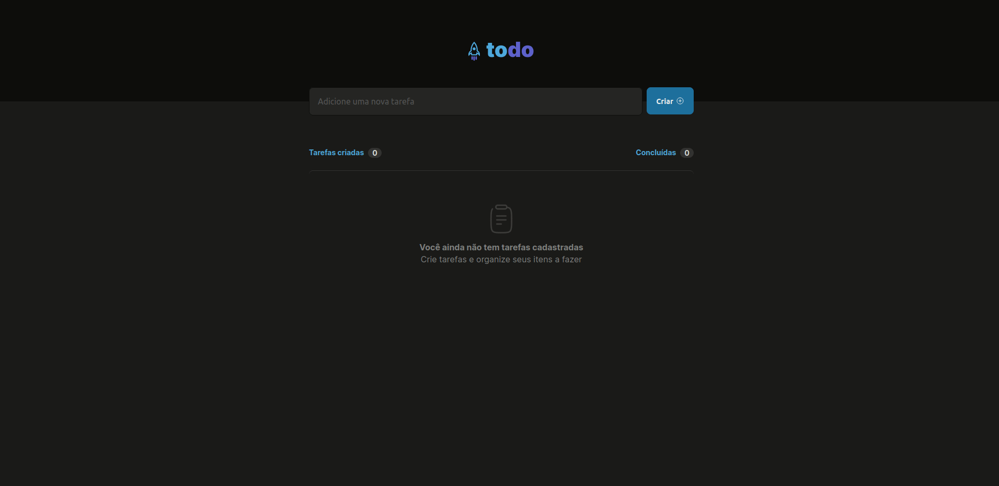

# Todolist-Ignite-Rocketseat
<h1 align="center">
    <a href="https://pt-br.reactjs.org/">🔗 React</a>
</h1>
<p align="center">🚀 Projeto prático do primeiro desafio do Ignite da Rocketseat</p>

<p align="center">
 <a href="#objetivo">Objetivo</a> •
 <a href="#roadmap">Roadmap</a> • 
 <a href="#tecnologias">Tecnologias</a> • 
 <a href="#contribuicao">Contribuição</a> • 
 <a href="#licenc-a">Licença</a> • 
 <a href="#autor">Autor</a>
</p>

<h4 align="center"> 
	🚧  React TodoList 🚀 Em construção...  🚧
</h4>

### Features

- [x] Adicionar uma nova tarefa
- [x] Marcar e desmarcar uma tarefa como concluída
- [x] Remover uma tarefa da listagem
- [x] Mostrar o progresso de conclusão das tarefas
- [x] Remover uma tarefa da listagem
- [ ] Expandir tarefa para adicionar mais informações (Tempo gasto, descrição, etc...)
- [] Adicionar icones de play e stop para indicar quando uma tarefa está em andamento ou parada.
- [ ] Adicionar cronometro para ser iniciado para dar play na tarefa e assim contabilizar o tempo gasto

### Demo
<h1 align="center">
  
</h1>

### Pré-requisitos

Antes de começar, você vai precisar ter instalado em sua máquina as seguintes ferramentas:
[Git](https://git-scm.com), [Node.js](https://nodejs.org/en/). 
Além disto é bom ter um editor para trabalhar com o código como [VSCode](https://code.visualstudio.com/)

### 🎲 Rodando a aplicação react (servidor)

```bash
# Clone este repositório
$ git clone <https://github.com/RicardoCassio/Todolist-Ignite-Rocketseat.git>

# Acesse a pasta do projeto no terminal/cmd
$ cd Todolist-Ignite-Rocketseat

# Instale as dependências
$ npm install

# Execute a aplicação em modo de desenvolvimento
$ npm run dev

# O servidor inciará na porta:5173 - acesse <http://localhost:5173>
```

### 🛠 Tecnologias

As seguintes ferramentas foram usadas na construção do projeto:

- [Vite](https://vitejs.dev//)
- [Node.js](https://nodejs.org/en/)
- [React](https://pt-br.reactjs.org/)
- [TypeScript](https://www.typescriptlang.org/)

## contribuidores
<table>
  <tr>
    <td align="center"><a href="https://github.com/ricardocassio/"><br /><sub><b>Ricardo Cássio</b></sub></a><br /><a href="https://github.com/ricardocassio/">👨‍🚀</a></td>
  </tr>
</table>

### Autor
---

<a href="https://github.com/ricardocassio/">
 
 <br />
 <sub><b>Ricardo Cássio</b></sub></a> <a href="https://github.com/ricardocassio/" title="Rocketseat">🚀</a>


Feito com ❤️ por Ricardo Cássio 👋🏽 Entre em contato!

[](https://www.linkedin.com/in/ricardo-cassio-5a1190a0/) 
[](mailto:ricardocassio@outlook.com.br)
